##  1.Java基础

###  集合的架构

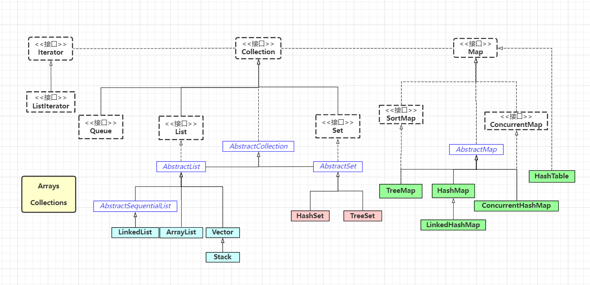

###  ArrayList的扩容机制

###  String

- 不可变，底层是final修饰的char数组，不变的主要作用是当一个对象要被多线程共享并频繁访问时可以保证数据的一致性
- 常量池优化，String对象创建后会在字符串常量池中进行缓存，下次创建同样对象时，会直接从缓存返回引用
- final，String不可被继承，提高系统的安全性

###  有没有用过TreeMap，HashMap的put原理，CurrentHashMap实现原理

####  hash函数

``(h = key.hashCode()) ^ (h >>> 16)``

````
为什么要右移？
0000 0000 0001 0000 0000 0000 0000 0000      #key的hashCode
                    0000 0000 0001 0000 0000 0000 0000 0000     #key右移
让hashCode的高16位和低16位都参与运算，保证散列性
````

key的hash值和其右移动16位，为的是保证hash函数的散列性，将高位向低位移动

####  为什么HashMap的容量要是2的n次幂

因为计算元素放置位置的计算方法为``i = (n - 1) & hash``，其中n为数组的长度

例如10 mod 8 余数为2，转为二进制如下

````
	
	# 一个数除以2^n，相当于其二进制位右移n位
	
	# 由上可以推导出，整数x除以2^n的余数为整数的二进制数的后n位
	0000 0000 0000 0000 0000 0000 0000 1010    #10
  & 0000 0000 0000 0000 0000 0000 0000 0111    #7
	0000 0000 0000 0000 0000 0000 0000 0010    #2

	
````

2^n 次幂如8 16 32 等，n-1转为二进制就是111 1111 11111，进行与运算时候只看后几位，可以减少hash碰撞

只有是2的n次幂才能进行按位运算来代替取模运算、

####  HashMap的put原理

- 对 key 的 hashCode () 进行 hash 后计算数组获得下标 index;
- 如果当前数组为 null，进行容量的初始化，初始容量为 16；
- 如果 hash 计算后没有碰撞，直接放到对应数组下标里；
- 如果 hash 计算后发生碰撞且节点已存在，则替换掉原来的对象；
- 如果 hash 计算后发生碰撞且节点已经是树结构，则挂载到树上。
- 如果 hash 计算后发生碰撞且节点是链表结构，则添加到链表尾，并判断链表是否需要转换成树结构（默认大于 8 的情况会转换成树结构）；
- 完成 put 后，是否需要 resize () 操作（数据量超过 threshold，threshold 为初始容量和负载因子之积，默认为 12）。

####  resize()方法

- 首次扩容

  - 无参构造下，如果是首次扩容，直接创建一个大小为初始容量16的Node数组
  - 带参构造指定初始值的情况下，将创建大于等于此值2的幂值大小的Node数组

- 不是首次扩容

  - 循环遍历数组长度，当节点位置不为null，将其赋值给临时变量e，并将其置为null，

  - 如果e.next==null，证明是单节点，将e赋值给newTab[e.hash&(newCap-1)]

  - 如果e instanceof TreeNode，进行红黑树处理

  - 否则证明e是链表元素，进行遍历链表，这里会做一下e.hash&oldCap==0判断，目的是将原来挂载在某个index的链表元素散列到新的数组中

    ````
    这里关于e.hash&oldCap==0的解释
    假设原key1和key2产生了hash碰撞，都挂载在原数组的index=15的位置上
    原挂载位置的计算方法key.hash&(oldCap-1),即
    00001111         #15
    10011010         #key1
    01101010         #key2
    即使key1和key2的hash值不一样，但是最后放入的位置都一样，因为只受低4位的影响
    
    现在将算法变为e.hash&oldCap，使计算结果只受n+1位影响
    00010000          #16
    10011010 		 #key1   =>1
    01101010          #key2   =>0
    从而将原链表的元素散列到新数组的高低位
    ````

####  为什么要使用红黑树

红黑树由AVL树演化而来，最长子树不可超过最短子树的2倍，取插入和查询性能的平衡点

###  线程生命周期，线程池参数，有哪几种拒绝策略，如何设置线程池中的参数

```java
1.核心线程数
    如果运行的线程数大于corePoolSize(线程池中的核心线程数)但小于maximumPoolSize(线程池中可存在的最大线程数)，那么只有在队列满时才会创建一个新的线程。 通过将corePoolSize和maximumPoolSize设置为相同的值，可以创建一个固定大小的线程池，也就是将线程池中允许存在的线程都设置为核心线程。
2.总线程数
3.存活时间
4.存活时间单位
5.线程存储队列
     5.1.有限队列-SynchronousQueue（在newCachedThreadPool()方法中使用）
                这是一个内部没有任何容量的阻塞队列，任何一次插入操作的元素都要等待相对的删除/读取操作，否则进行插入操作的线程就要一直等待，反之亦然
                public static ExecutorService newCachedThreadPool() {
                        return new ThreadPoolExecutor(0, Integer.MAX_VALUE,
                                                      60L, TimeUnit.SECONDS,
                                                      new SynchronousQueue<Runnable>());
                }
         有限队列-ArrayBlockingQueue
                是一个由数组支持的有界阻塞队列（先进先出），假设初始队列长度为2，当添加第三个元素时线程会进行阻塞。同样的，当元素为空的时候，进行获取也会进行阻塞。
     5.2 无限队列-LinkedBlockingQueue
                创建ThreadPoolExecutor常用的队列。
                当不设置队列初始长度，则为无界队列。
                当设置队列初始长度则类似于ArrayBlockingQueue即插入与读取都会为空进行堵塞。
 6.ThreadFactory给一组线程用来命名，阿里巴巴规范建议使用，方便以后的错误查找。
 7.默认拒绝策略
     7.1 AbortPolicy(抛出一个异常，默认的)
     7.2 DiscardPolicy(直接丢弃任务)
     7.3 DiscardOldestPolicy（丢弃队列里最老的任务，将当前这个任务继续提交给线程池）
     7.4 CallerRunsPolicy（交给线程池调用所在的线程进行处理)
     PS：使用DiscardPolicy或者DiscardOldestPolicy，并且线程池饱和了的时候，我们将会直接丢弃任务，不会抛出任何异常。这个时候再来调用get方法是主线程就会一直等待子线程返回结果，直到超时抛出TimeoutException。
```
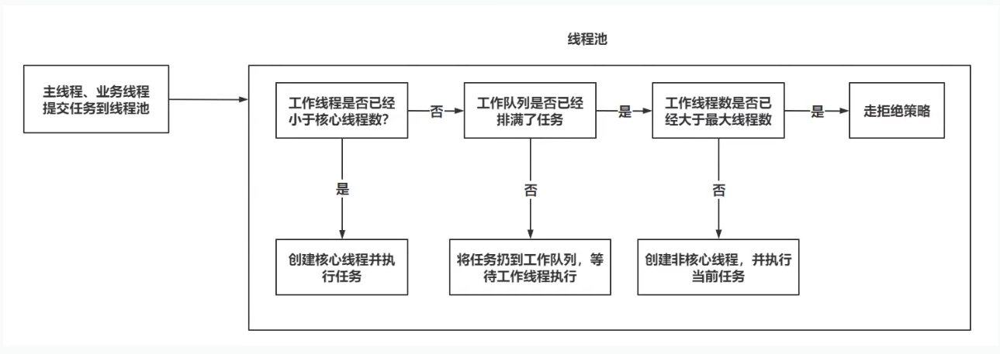


###  如何动态调整线程池的大小

###  线程池中线程如何自定义命名

```java
实现ThreadFactory类，重写newThread()方法
```

###  阻塞队列的理解

###  聊聊AQS

三大核心

- state变量，对于每个集成aqs类的含义是不同的
- 一个FIFO的队列，底层是双向链表，维持排队任务
- 需要实现获取/释放的方法

###  聊聊volatile和synchronized

####  volatile

- 保证线程之间的可见性

  底层通过总线的MESI缓存一致性协议和CPU的总线嗅探机制实现的，可以介绍一下JMM

  在Java内存模型中，每个线程都有自己的工作内存（Working Memory），线程对共享变量的操作都是在工作内存中进行的，而不是直接在主内存中进行。这就意味着，一个线程对共享变量的修改可能不会立即被其他线程所看到。

而使用volatile关键字声明的变量，会被JVM标记为“易变的”（Volatile），在进行读写操作时会直接访问主内存中的最新值，而不是使用工作内存中的缓存值。这样一来，就保证了所有线程对该变量的访问都是同步的，并且可以看到其他线程对变量的修改。

- 禁止指令重排

  - 什么是指令重排？

    CPU为了提高效率，会将无关的指令进行重新排序

  - 如何做到

    1、JVM层面使用了内存屏障，内存屏障的两侧指令不可重排

    在每个volatile写操作前插入StoreStore屏障，这样就能让其他线程修改A变量后，把修改的值对当前线程可见，在写操作后插入StoreLoad屏障，这样就能让其他线程获取A变量的时候，能够获取到已经被当前线程修改的值

    在每个volatile读操作前插入LoadLoad屏障，这样就能让当前线程获取A变量的时候，保证其他线程也都能获取到相同的值，这样所有的线程读取的数据就一样了，在读操作后插入LoadStore屏障；这样就能让当前线程在其他线程修改A变量的值之前，获取到主内存里面A变量的的值。

    2、在汇编码层面，使用的是Lock前缀的指令实现

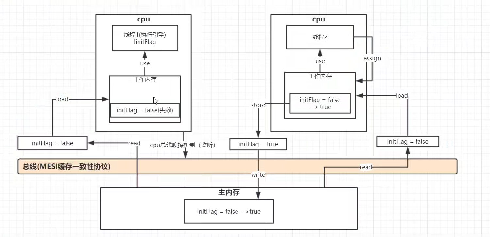
####  synchronized
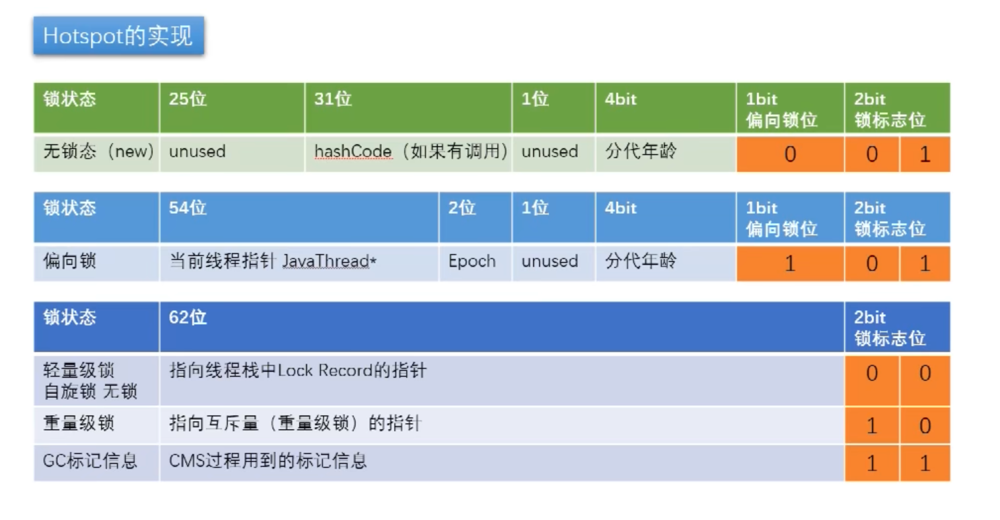
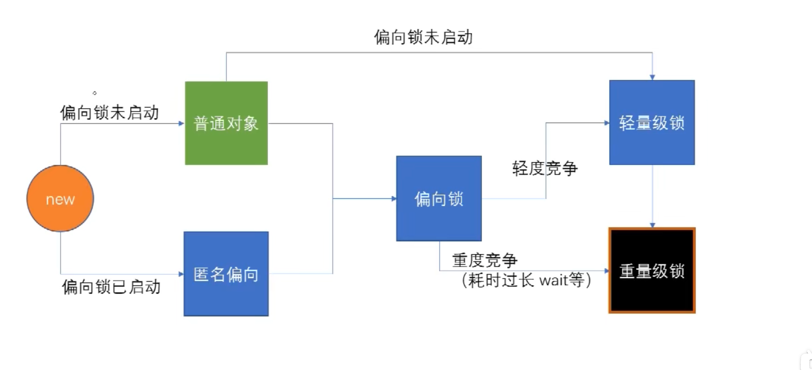


- 字节码层面

​		字节码加锁**monitorenter**

​		字节码解锁**monitorexit**

底层大量的CAS操作

锁升级是通过标记对象头的markword的后两位来实现的


普通对象 - 偏向锁（Thread ID）- 自旋锁（CAS 将Lock record指向加锁对象）


### 自旋锁什么时候升级为重量级锁（通过CPP向操作系统申请资源）？

线程自旋次数过多，Jvm有自己自适应机制调节

### 为什么有自旋锁还需要重量级锁

自选是消耗CPU资源的，如果锁时间长，或者自旋线程多，会消耗CPU资源

重量级锁有等待队列ObjectMonitor中的WaitSet，所有拿不到锁的进入等待队列，不需要消耗CPU

### 偏向锁是否一定比自旋锁效率高

不一定，在明确知道会有多线程竞争的情况下，偏向锁会涉及锁的撤销，直接使用自旋锁。
JVM启动过程中，默认情况启动时不打开偏向锁，过一会再打开

-  汇编指令

   ```shell
   lock cmpxchg
   ```

synchronized是可重入锁
重入次数需要记录，偏向锁记录在线程栈中


###  谈谈对ThreadLocal的理解

线程本地变量内部是一个ThreadLocalMap，其内部是一个Entry数组，每个Entry对象由k,v键值对构成，key保存的是ThreadLocal对象，v保存的是set的值

###  ThreadLocal的内存泄露怎么解决？使用过程中有没有遇见过线程安全性问题，怎么解决的

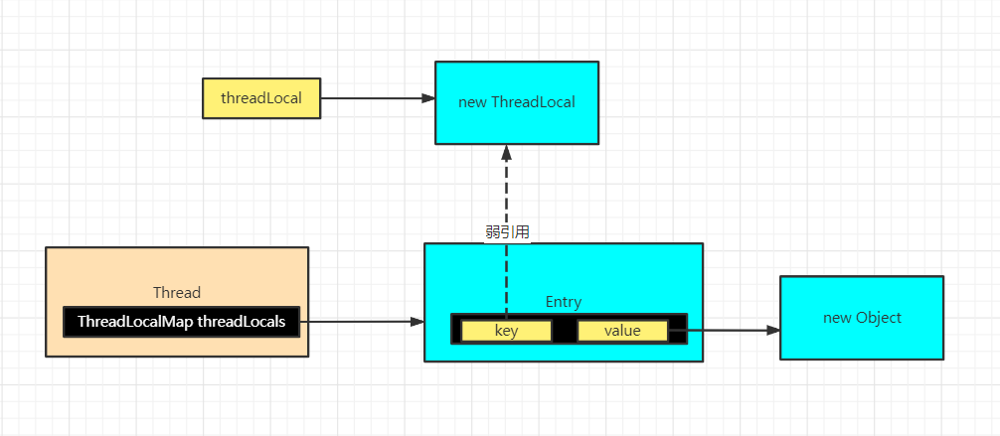

threadLocal对象使用完毕之后，由于没有强引用指向，而new ThreadLocal和Entry的Key是弱引用，在GC时会直接回收key，从而无引用指向value，但是value是实际存在的，所以会造成内存泄露

###  ThreadLocal的子父线程传递问题

```java
InheritableThreadLocal
```

##  2 JVM

###  JVM内存的各个分区及其作用

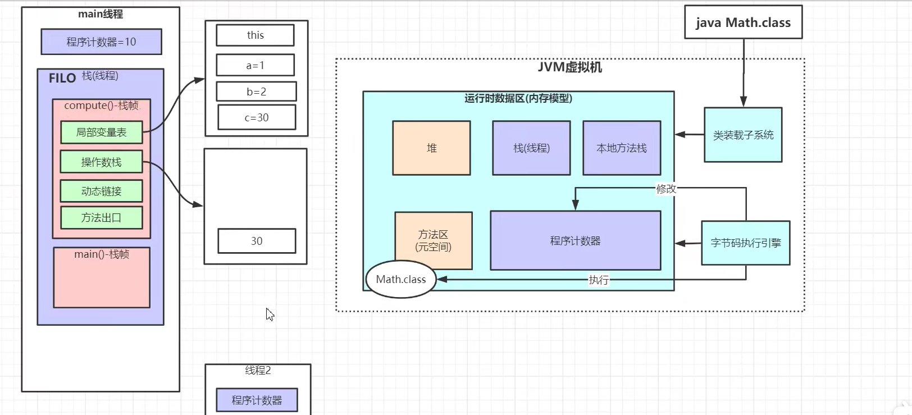

###  JVM的类加载机制以及为何要这样设计

###  垃圾回收算法

- 标记清除

  缺点：造成内存碎片

-  复制

  缺点：内存浪费

- 标记压缩

  缺点：效率低

  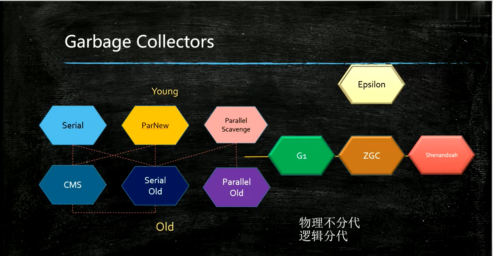

###  垃圾如何识别，其中可达性分析中以哪些对象作为GCROOT

###  有哪些垃圾收集器，聊一下CMS和G1

###  年轻代用什么垃圾回收算法，老年代用什么垃圾回收算法以及原因

###  线上频繁出现fullgc和OOM情况怎么定位问题

- fullgc

  使用-XX +开启GC日志参数，分析GC日志

- OOM

  1、使用-XX:+HeapDumpOnOutOfMemoryError -XX:HeapDumpPath=/opt/heap指定程序发生OOM时Dump日志

  2、使用jprofiler类的软件进行堆内存分析，找出最大对象

##  3 中间件

###  redis为什么是单线程的？单线程为何快？

###  redis的字符类型底层实现

###  redis做分布式锁要注意什么

- 设置锁的失效时间，并且确保setnx和expire两条指令的原子性，可以使用Lua脚本保证
- 删除锁的时候后，需要确保是当前线程删除了当前线程加的锁，可以使用uuid进行对比
- 设置锁的续期，场景是发生STW的时候，T1执行时间可能超过锁的超时时间，此时锁失效，T2线程认为无人上锁，开始执行代码块，此时STW结束，T1继续执行，可能会造成并发安全问题
- 集群模式下节点挂掉的情况，可能需要使用RedLock来保证加锁成功，也就是确保大多数节点加锁成功，才认可加锁成功

###  穿透、雪崩、击穿的解决方案

####   缓存穿透

缓存穿透：去缓存层没有命中数据，进而去mysql中查询也未命中

用一个简单的架构图来说明如下

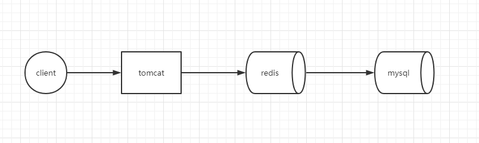

需要明白的是，一旦系统中引入了缓存层就不可能避免缓存穿透，我们需要做到的是避免高频的穿透，允许低频的穿透。

- 对于相同的请求参数频繁访问，且该数据在数据库中不存在例如id=-1，将发生穿透，可将缓存层置为null，防止频繁访问数据库
- 对于随机参数的频繁访问，例如id=UUID，将高频的发生缓存穿透，此时的解决方案为，在redis和mysql之间加入过滤器

架构图变为如下：

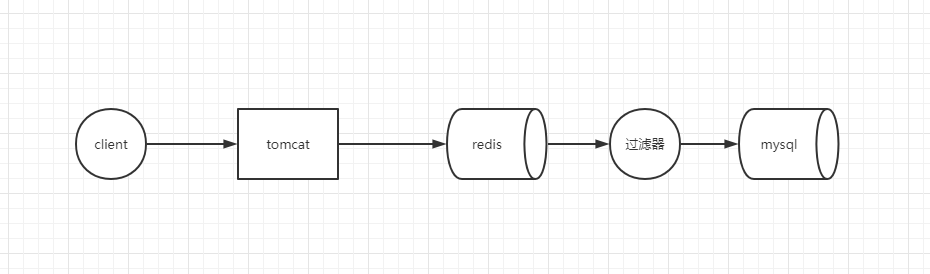

此过滤器将存在以下问题

- 过滤器需要保存一份mysql数据在内存中，占用资源

由此引入了布隆过滤器，其结构如下：

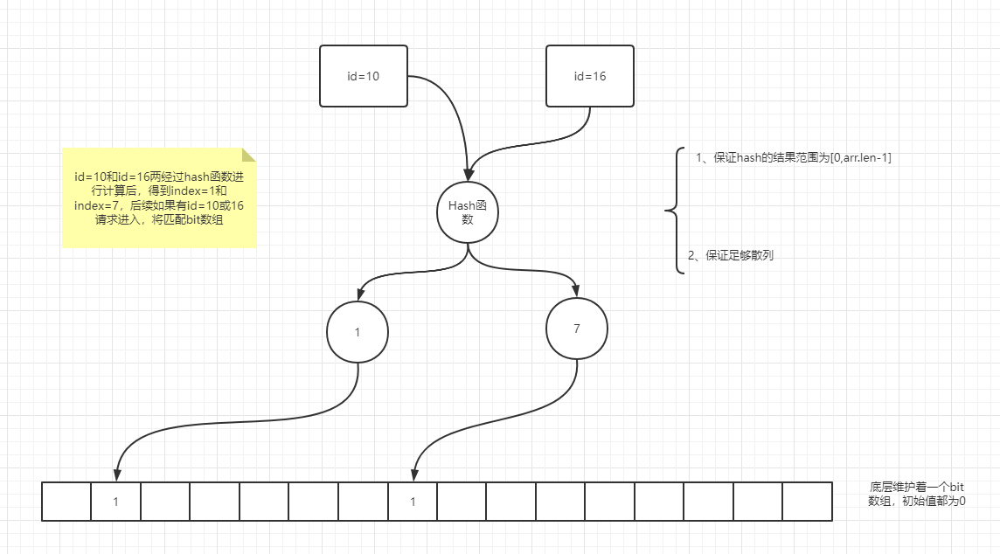

布隆过滤器核心思想：用一定的错误率来换取空间

错误率的产生是由于产生Hash碰撞，id=1或id=16都可能被hash为index=1，因此

- 布隆过滤器说数据存在，数据不一定存在
- 布隆过滤器说数据不存在，则数据一定不存在

为了降低Hash碰撞，可以采取

- 增加数组大小
- 增加Hash函数的个数

####  缓存雪崩

缓存中大量热点数据在某一时刻突然失效或无法使用，导致大量的请求落在mysql上，导致系统宕机

原因

​	1.可能是redis中缓存的数据有效期一致

- 可以给每条数据设置随机失效时间

​    2.redis宕机

- 集群

补充一下Redis集群的hash一致性算法

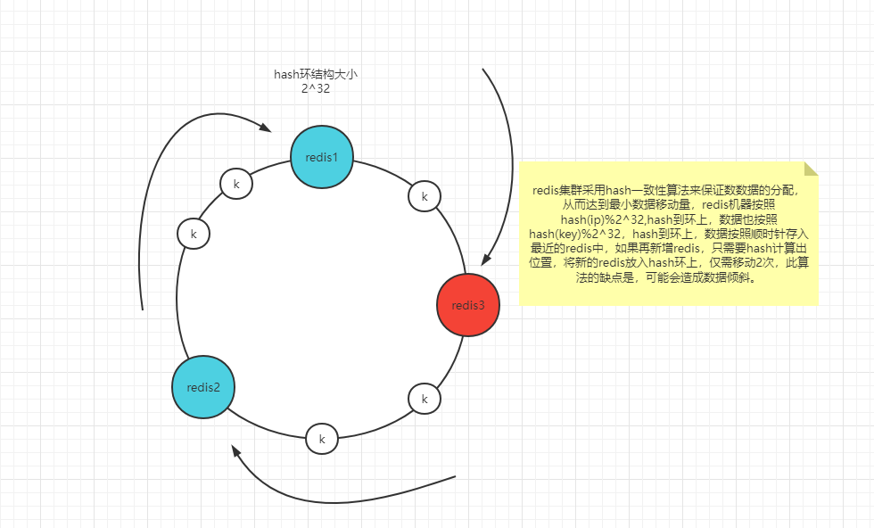

####  缓存击穿

缓存中某一条热点数据突然失效，导致大量请求打在数据库上

对于缓存击穿可以使用如下方案

- 使用分布式锁，但是效率很低
- 设置热点数据不过期，由定时任务异步加载数据，更新缓存

###  如何判断redis中那些数据为热点数据

**利用redis4.x自身特性，LFU机制发现热点数据**。只要把redis内存淘汰机制设置为[allkeys-lfu](https://www.zhihu.com/search?q=allkeys-lfu&search_source=Entity&hybrid_search_source=Entity&hybrid_search_extra={"sourceType"%3A"article"%2C"sourceId"%3A"67411948"})或者volatile-lfu方式，再执行

```she
./redis-cli --hotkeys
```

- allkeys-lfu：从所有键中驱逐使用频率最少的键

###  如何保证数据库和redis数据一致

###  mq怎么确保消息不被重复消费和消息不丢失

###  SQL的执行流程

mysql的架构图

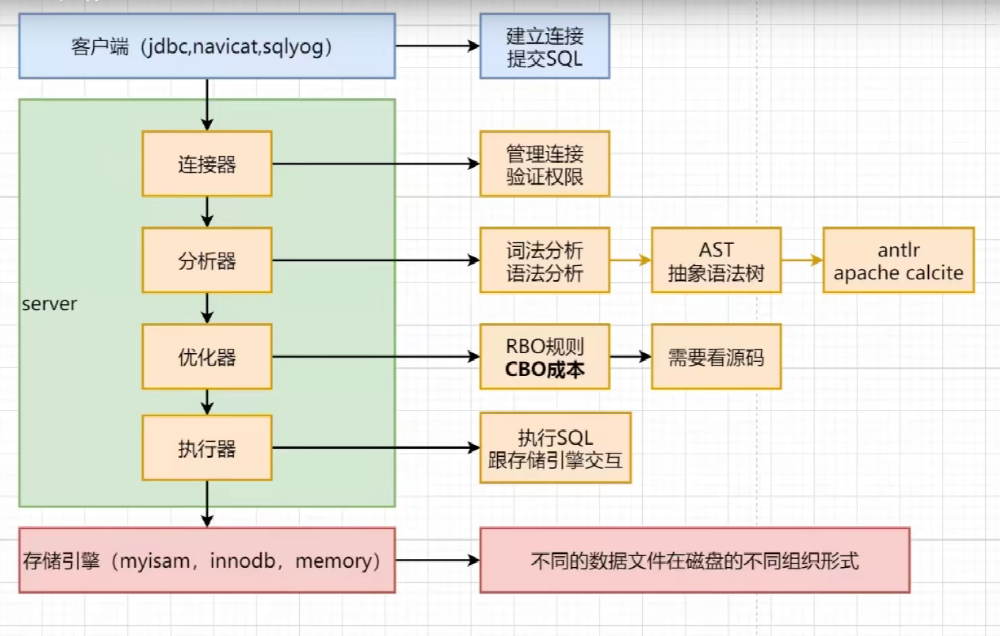

抽象语法树AST

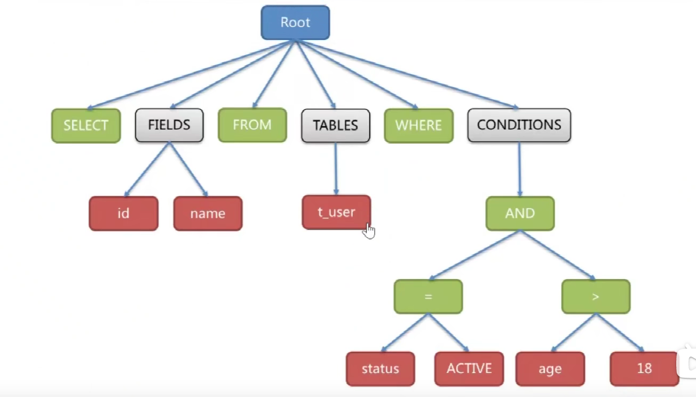

###  Mysql的关键字执行流程

```sql
from--where--group by--having--select--order by
```

###  Mysql的存储引擎

####  存储引擎

- InnoDB
- MyISAM
- Memory
- Archive

####  InnoDB和MyISAM的区别

- InnoDB支持事务，MyISAM不支持事务，强调的是性能，查询速度更快
- InnoDB支持行锁及表锁，MyISAM只支持表锁
- InnoDB支持外键，MyISAM不支持
- InnoDB的索引和数据是放在一个文件中的，MyISam的索引文件和数据文件是分开的

###  索引结构，为什么是B+不是B，B+一般几层

**为什么要设计索引**

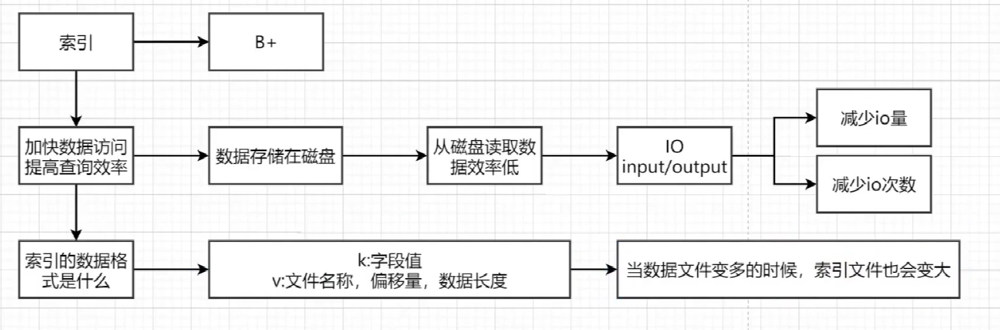

**innodb不使用hash表的原因**

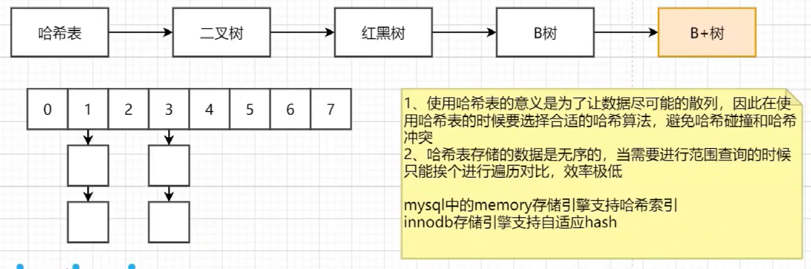

**为何不使用二叉树**

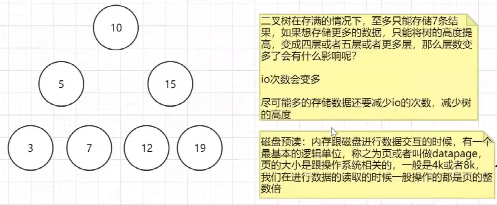

**b树和b+树的数据结构区别**

b树的叶子节点没有指针相互指向

b树的叶子节点不包含全量数据，因此使用b树作为索引结构则要求非叶子节点必须保存data，而磁盘读取是按页（4K或8K的整数倍）来读取的，故同等层数的b树保存的数据远远低于b+树

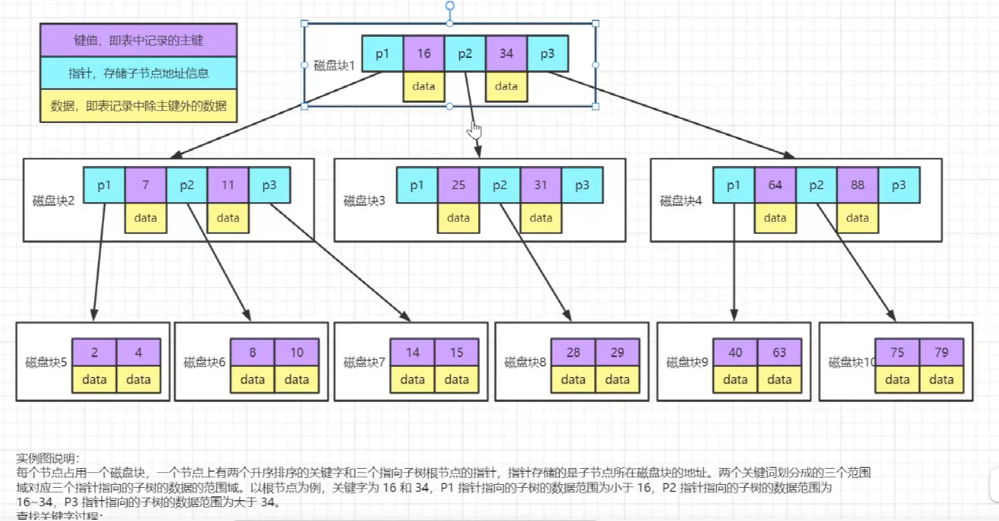

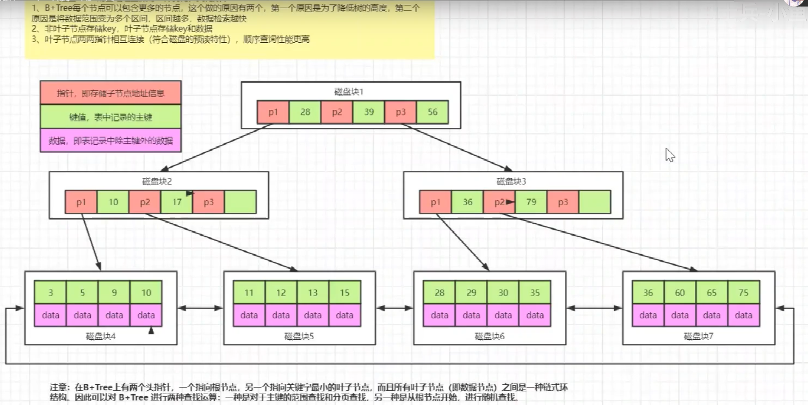

**一般情况下3-4层的b+树足以支撑千万级别的数据**

###  聚簇索引和非聚簇索引

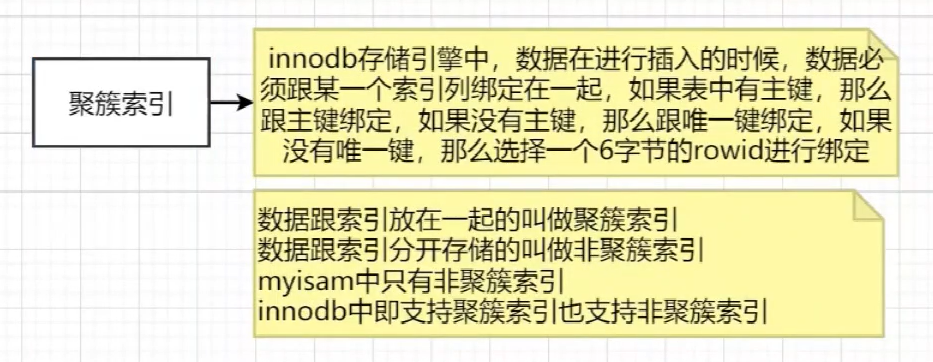

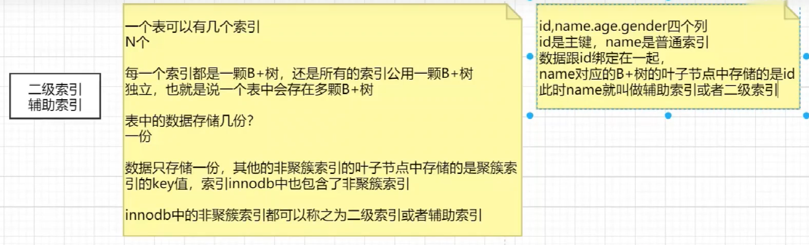

**聚簇索引和非聚簇索引的结构对比**

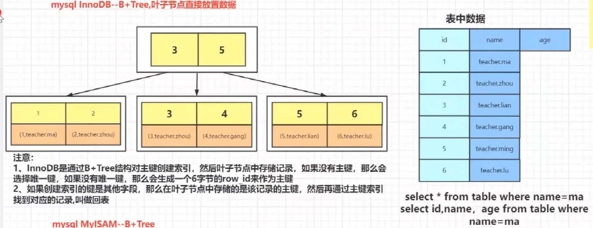

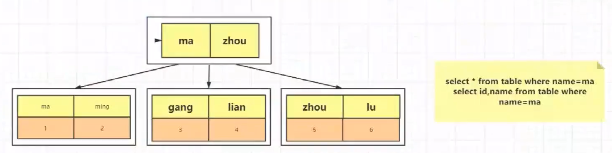

###  索引设计要注意的点和常见的索引失效情况

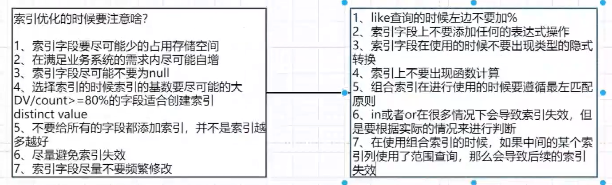

###  索引的分类

- 主键索引
- 唯一索引
- 普通索引
- 全文索引
- 组合索引

###  回表、索引覆盖、索引下推、最左匹配原则

```sql
回表
id、name、age、gender，id是主键，name是普通索引，
select * from table where name = "zhangsan";
查找过程：先根据name的值去name的b+树找到对应叶子节点，取出id值，再根据id值取id的b+树查找全部结果，这个过程称为回表
回表效率较低，因此要尽可能避免回表
```

```sql
索引覆盖
id、name、age、gender，id是主键，name是普通索引，
select id,name from table where name = "zhangsan";
查找过程：先根据name的值去name的b+树查询结果，能够直接获取到id和name，不需要去id的b+树查数据了，此过程称为索引覆盖
索引的叶子节点包含了要查询的全部数据，叫做索引覆盖，推荐使用
```

```sql
最左匹配
id、name、age、gender，id是主键，name、age是组合索引，
select * from table where name = ?;[符合]
select * from table where name = ? and age = ?;[符合]
select * from table where age = ?; [不符合]
```

###  事务的四大特性和隔离级别

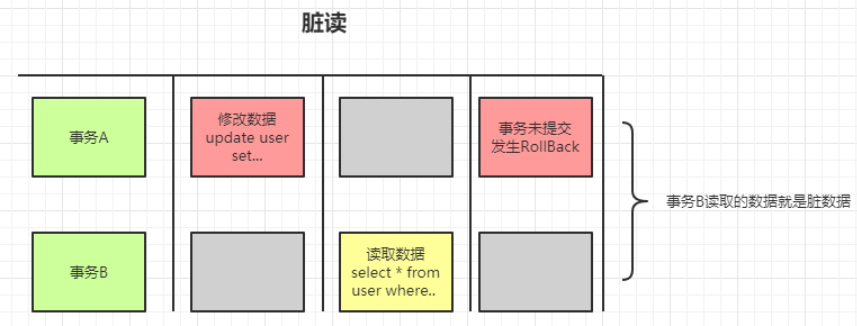

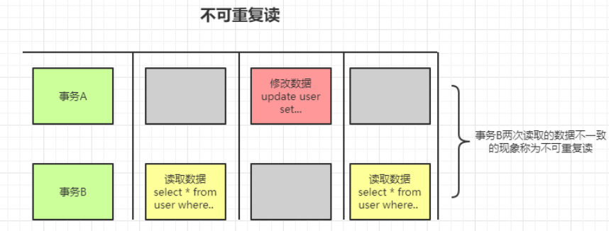

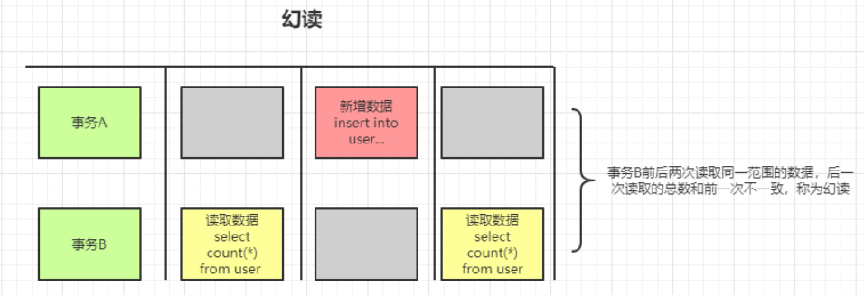

```sql
幻读和不可重复读有点类似，但是幻读强调的是单条数据的不一致而幻读强调集合(读取数据条数)的不一致
四大特性
    原子性----undo log
    一致性----保证了其他三个特性即保证了一致性
    隔离性----MVCC多版本并发控制
    持久性----redo log
隔离级别
    读未提交：一个事务可以读取到另一个事务未提交的修改。这会带来脏读、幻读、不可重复读问题。（基本没用）
    读已提交：一个事务只能读取另一个事务已经提交的修改。其避免了脏读，但仍然存在不可重复读和幻读问题。
    可重复读：同一个事务中多次读取相同的数据返回的结果是一样的。其避免了脏读和不可重复读问题，但幻读依然存在。
    串行化：事务串行执行。避免了以上所有问题。
```

###  MCVV

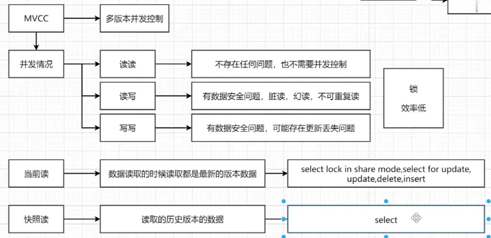

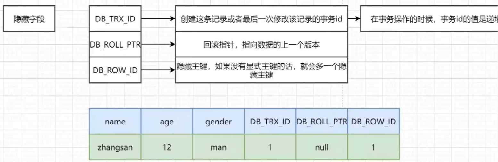

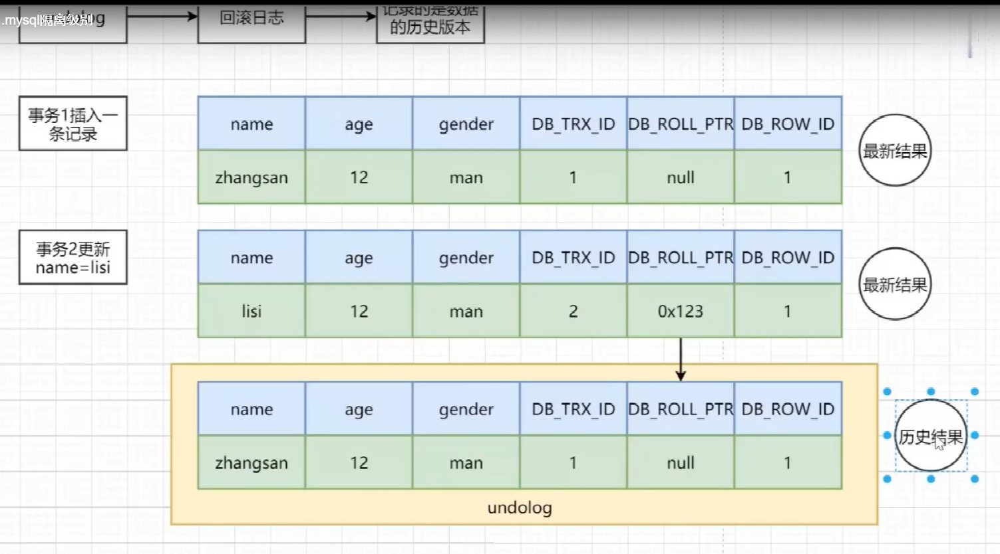

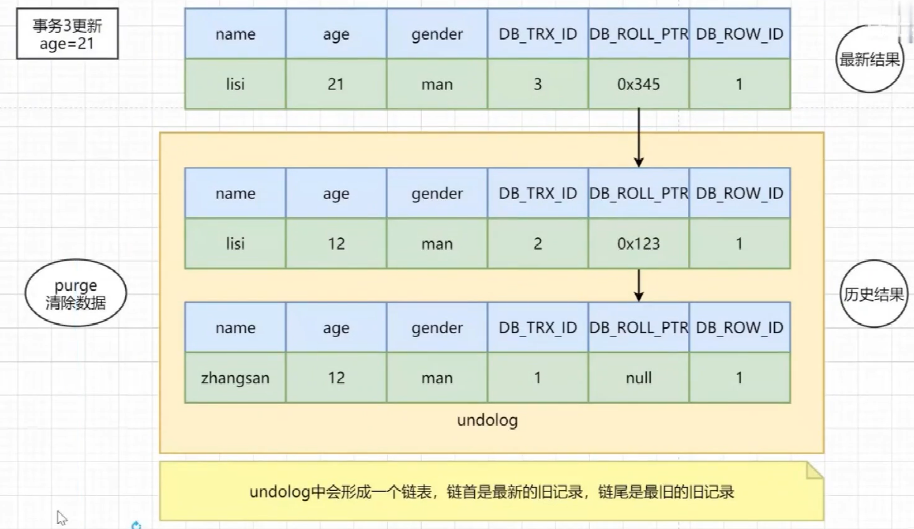

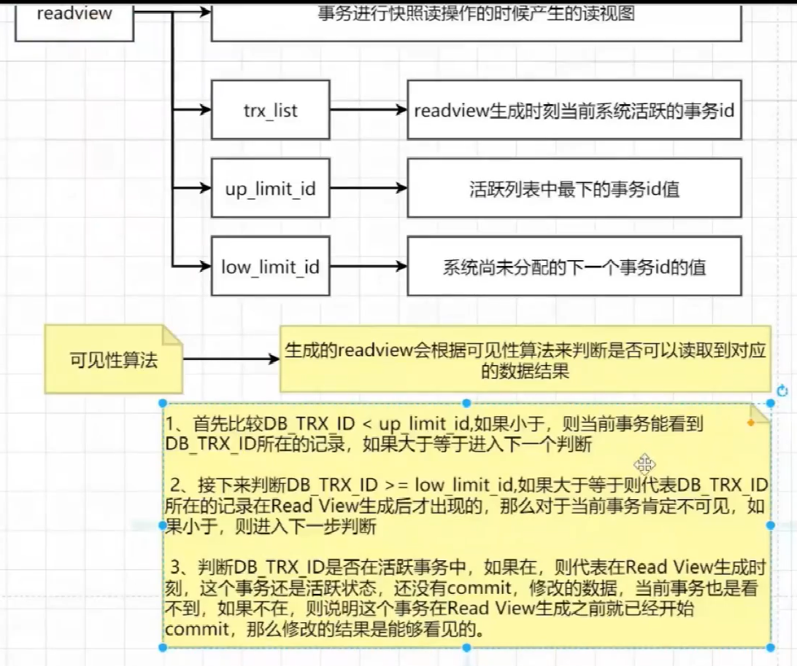

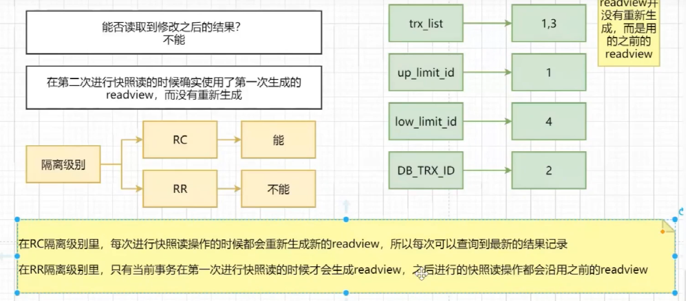

###  mysql如何解决幻读问题

```sql
幻读产生的本质原因是什么?
如果事务中进行的操作都是快照读，那么是不会产生幻读问题的，但是当快照读和当前读同时使用的时候就会产生幻读问题，解决方式为加锁
select for update
```

###  执行计划中有哪些比较重要的参数

- type：执行类型
- key：索引
- extra：额外信息

###  mysql的binlog、undolog、redolog

- binlog负责数据的同步
- undolog负责保证事务的原子性
- redolog负责保证事务的持久化

##  4 框架

###  Spring中的控制反转理解

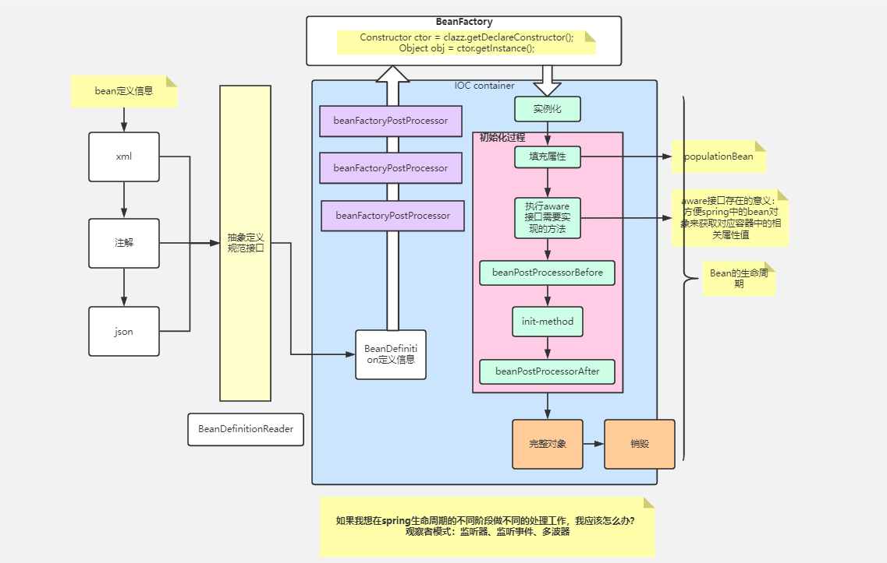

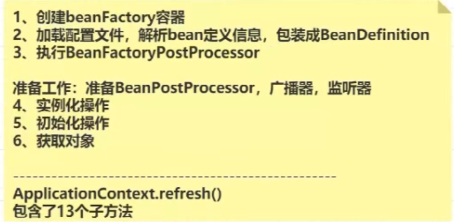

###  谈谈对Spring AOP的理解

###  Spring的事务传播特性

###  事务失效的情况

###  bean的生命周期

###  Spring中用到了哪些设计模式

###  Spring怎么解决循环依赖问题

###  SpringCloud和Dubbo优缺点

###  Mybatis执行一条sql的流程

###  Mybatis缓存是否了解

#### 一级缓存

在应用运行过程中，我们有可能在一次数据库会话中，执行多次查询条件完全相同的SQL，MyBatis提供了一级缓存的方案优化这部分场景，如果是相同的SQL语句，会优先命中一级缓存，避免直接对数据库进行查询，提高性能。具体执行过程如下图所示。

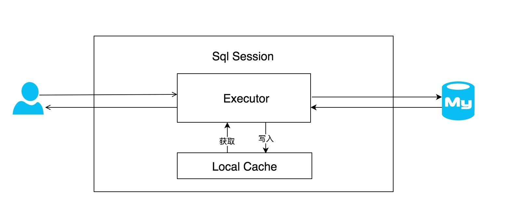

开发者只需在MyBatis的配置文件中，添加如下语句，就可以使用一级缓存。共有两个选项，SESSION或者STATEMENT，默认是SESSION级别，即在一个MyBatis会话中执行的所有语句，都会共享这一个缓存。一种是STATEMENT级别，可以理解为缓存只对当前执行的这一个Statement有效。

```shell
<setting name="localCacheScope" value="SESSION"/>
```

####  二级缓存


##  6 分布式

###  分布式锁实现的常见方式和优缺点

- zk实现

  CP

- redis实现

  AP

###  kafka架构图
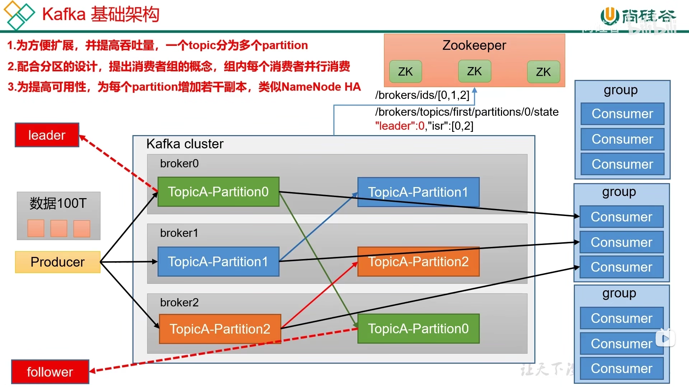

###  分布式事务常见的实现方式

- 2PC（两阶段提交）

  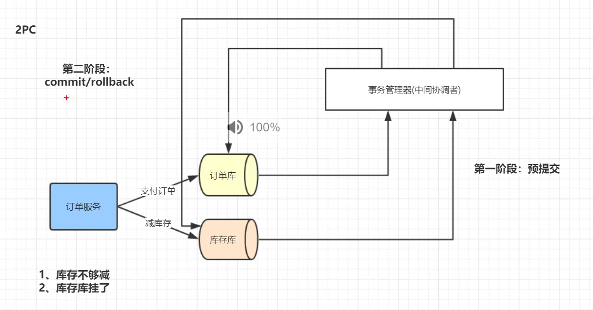

- TCC （Try-Confirm-Cancel）

  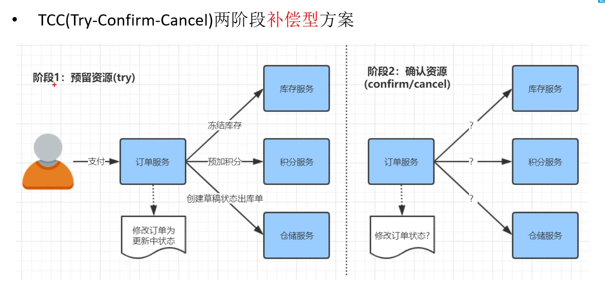

###  分布式事务接口怎么确保幂等

##  7 服务器

###  docker常用命令

```shell
docker logs -f -t --tail=20 redis
docker run
docker images
docker ps
docker pull
```

###  k8s常用命令

```shell
kubectl logs -f
kubectl get nodes
```


