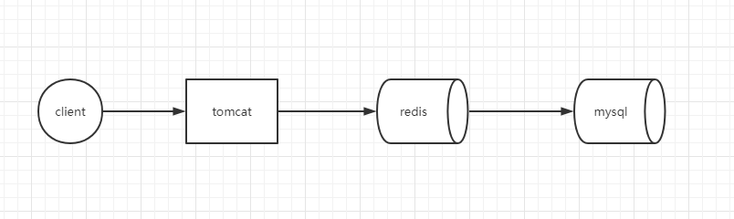
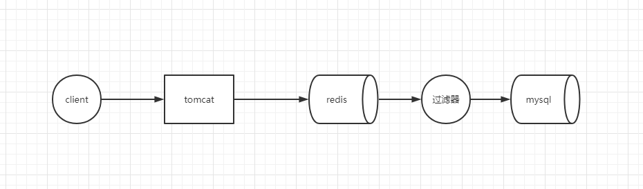
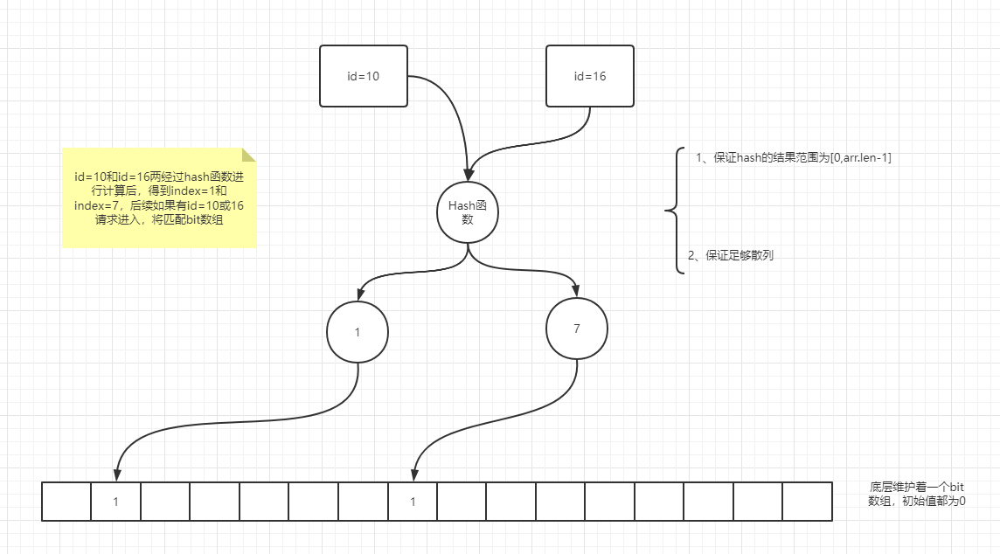

##  1.Java基础

###  1.1 ArrayList的扩容机制

###  1.2 String

- 不可变，底层是final修饰的char数组，不变的主要作用是当一个对象要被多线程共享并频繁访问时可以保证数据的一致性
- 常量池优化，String对象创建后会在字符串常量池中进行缓存，下次创建同样对象时，会直接从缓存返回应用
- final，String不可被继承，提高系统的安全性

###  1.3 有没有用过TreeMap，HashMap的put原理，CurrentHashMap实现原理

####  1.3.1 hash函数

``(h = key.hashCode()) ^ (h >>> 16)``

````
为什么要右移？
0000 0000 0001 0000 0000 0000 0000 0000      #key的hashCode
                    0000 0000 0001 0000 0000 0000 0000 0000     #key右移
让hashCode的高16位和低16位都参与运算，保证散列性
````

key的hash值和其右移动16位，为的是保证hash函数的散列性，将高位向低位移动

####  1.3.2 为什么HashMap的容量要是2的n次幂

因为计算元素放置位置的计算方法为``i = (n - 1) & hash``，其中n为数组的长度

例如10 mod 8 余数为2，转为二进制如下

````
	 0000 0000 0000 0000 0000 0000 0000 1010    #10
 ÷   0000 0000 0000 0000 0000 0000 0000 1000    #8
	
	# 一个数除以2^n，相当于其二进制位右移n位，余数为移动后的数
	即为010=2
	
	# 由上可以推导出，整数x除以2^n的结果为整数的二进制数的后n位
	0000 0000 0000 0000 0000 0000 0000 1010    #10
  & 0000 0000 0000 0000 0000 0000 0000 0111    #7
	0000 0000 0000 0000 0000 0000 0000 0010    #2

	
````

2^n 次幂如8 16 32 等，n-1转为二进制就是111 1111 11111，进行与运算时候只看后几位，可以减少hash碰撞

只有是2的n次幂才能进行按位运算来代替取模运算、

####  1.3.3 HashMap的put原理

- 对 key 的 hashCode () 进行 hash 后计算数组获得下标 index;
- 如果当前数组为 null，进行容量的初始化，初始容量为 16；
- 如果 hash 计算后没有碰撞，直接放到对应数组下标里；
- 如果 hash 计算后发生碰撞且节点已存在，则替换掉原来的对象；
- 如果 hash 计算后发生碰撞且节点已经是树结构，则挂载到树上。
- 如果 hash 计算后发生碰撞且节点是链表结构，则添加到链表尾，并判断链表是否需要转换成树结构（默认大于 8 的情况会转换成树结构）；
- 完成 put 后，是否需要 resize () 操作（数据量超过 threshold，threshold 为初始容量和负载因子之积，默认为 12）。

####  1.3.4 resize()方法

- 首次扩容

  - 无参构造下，如果是首次扩容，直接创建一个大小为初始容量16的Node数组
  - 带参构造指定初始值的情况下，将创建大于等于此值2的幂值大小的Node数组

- 不是首次扩容

  - 循环遍历数组长度，当节点位置不为null，将其赋值给临时变量e，并将其置为null，

  - 如果e.next==null，证明是单节点，将e赋值给newTab[e.hash&(newCap-1)]

  - 如果e instanceof TreeNode，进行红黑树处理

  - 否则证明e是链表元素，进行遍历链表，这里会做一下e.hash&oldCap==0判断，目的是将原来挂载在某个index的链表元素散列到新的数组中

    ````
    这里关于e.hash&oldCap==0的解释
    假设原key1和key2产生了hash碰撞，都挂载在原数组的index=15的位置上
    原挂载位置的计算方法key.hash&(oldCap-1),即
    00001111         #15
    10011010         #key1
    01101010         #key2
    即使key1和key2的hash值不一样，但是最后放入的位置都一样，因为只受低4位的影响
    
    现在将算法变为e.hash&oldCap，使计算结果只受n+1位影响
    00010000          #16
    10011010 		 #key1   =>1
    01101010          #key2   =>0
    从而将原链表的元素散列到新数组的高低位
    ````

 
###  1.4 线程生命周期，线程池参数，有哪几种拒绝策略，如何设置线程池中的参数?

###  1.5 JUC包下的常用类和使用场景，聊聊AQS

###  1.6 聊聊volatile和synchronized

##  2 JVM

###  2.1 JVM内存的各个分区及其作用

###  2.2 垃圾回收算法

###  2.3 垃圾如何识别，其中可达性分析中以哪些对象作为GCROOT

###  2.4 有哪些垃圾收集器，聊一下CMS和G1

###  2.5 年轻代用什么垃圾回收算法，老年代用什么垃圾回收算法以及原因

###  2.6 线上频繁出现fullgc和OOM情况怎么定位问题

###  2.7类加载机制

##  3 中间件

###  3.1 redis为什么是单线程的？单线程为何快？

###  3.2 redis的字符类型底层实现

###  3.3 redis做分布式锁要注意什么

###  3.4 穿透、雪崩、击穿的解决方案

####   3.4.1 缓存穿透

缓存穿透：去缓存层没有命中数据，进而去mysql中查询也未命中

用一个简单的架构图来说明如下



需要明白的是，一旦系统中引入了缓存层就不可能避免缓存穿透，我们需要做到的是避免高频的穿透，允许低频的穿透。

- 对于相同的请求参数频繁访问，且该数据在数据库中不存在例如id=-1，将发生穿透，可将缓存层置为null，防止频繁访问数据库
- 对于随机参数的频繁访问，例如id=UUID，将高频的发生缓存穿透，此时的解决方案为，在redis和mysql之间加入过滤器

架构图变为如下：



此过滤器将存在以下问题

- 过滤器需要保存一份mysql数据在内存中，占用资源

由此引入了布隆过滤器，其结构如下：



布隆过滤器核心思想：用一定的错误率来换取空间

错误率的产生是由于产生Hash碰撞，id=1或id=16都可能被hash为index=1，因此

- 布隆过滤器说数据存在，数据不一定存在
- 布隆过滤器说数据不存在，则数据一定不存在

为了降低Hash碰撞，可以采取

- 增加数组大小
- 增加Hash函数的个数

####  3.4.2 缓存雪崩

缓存中大量热点数据在某一时刻突然失效或无法使用，导致大量的请求落在mysql上，导致系统宕机

原因

​	1.可能是redis中缓存的数据有效期一致

- 可以给每条数据设置随机失效时间

​    2.redis宕机

- 集群

补充一下Redis集群的hash一致性算法


####  3.4.3 缓存击穿

缓存中某一条热点数据突然失效，导致大量请求打在数据库上

对于缓存击穿可以使用如下方案

- 使用分布式锁，但是效率很低
- 设置热点数据不过期，由定时任务异步加载数据，更新缓存

###  3.5 如何判断redis中那些数据为热点数据

###  3.6 Mysql的存储引擎

###  3.7 索引结构，为什么是B+不是B，B+一般几层

###  3.8 索引覆盖、索引下推

###  3.9 数据库事务，mysql如何解决幻读问题

###  3.10 执行计划中有哪些比较重要的参数

###  3.11 sql中的最左匹配原则

###  3.12 mysql的binlog、undolog、redolog

##  4 框架

###  4.1 Spring中的控制反转理解

###  4.2 Spring的事务传播特性

###  4.3 bean的生命周期

###  4.4 Spring中用到了哪些设计模式

###  4.5 Spring怎么解决循环依赖问题


